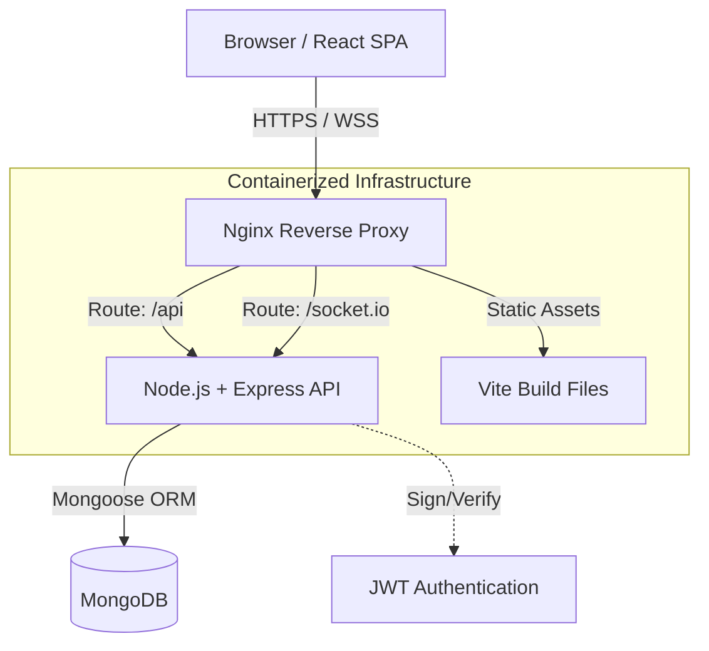

<div align="center">
  
  <h1>⚡ Echo — Real-Time Chat Architecture</h1>
  <p><strong>A production-ready, full-stack real-time messaging platform built for performance, security, and scale.</strong></p>

  <!-- Badges -->
  <a href="https://github.com/nandhubabu/echo_Real-time-chat-app/actions"></a>
  
  
  
</div>

<br />

## 🎯 Executive Summary
**Echo** is not just another chat app—it is a comprehensive showcase of modern web engineering. I architected this application to demonstrate my ability to build **scalable, secure, and production-ready** full-stack systems from scratch. 

From **real-time WebSocket** integrations and **JWT security** paradigms to **CI/CD automation**, **Dockerized** microservices, and **SEO configurations**, this project reflects my readiness to tackle complex software engineering challenges in a professional environment.

---

## 🏆 Key Engineering Achievements

### 1. Infrastructure & DevOps (CI/CD, Docker, Nginx)
*   **Continuous Integration (CI/CD):** Implemented automated GitHub Actions workflows (`ci.yml`, `deploy.yml`) to guarantee code quality by automatically testing and building the client and server on every pull request.
*   **Containerization:** Designed isolated `Dockerfile` environments for the React frontend and Node.js backend, orchestrated via `docker-compose.yml` for seamless, environment-agnostic local development.
*   **Nginx Reverse Proxy & Load Balancing:** Configured (or designed to support) **Nginx** to act as an API Gateway, efficiently handling SSL termination, static file serving, and reverse proxying WebSocket/HTTP traffic to backend instances.

### 2. SEO & Webmaster Integrations
*   **Google Search Console Verified:** Integrated `google[...].html` domain verification for active Google crawling and indexing.
*   **Technical SEO:** Configured semantic HTML, meta tags, and optimized Vite build processes to ensure high Lighthouse scores, making the application highly discoverable despite being a dynamic React SPA.

### 3. Security First Architecture
*   **Stateless Authentication:** Engineered a robust auth flow utilizing **JSON Web Tokens (JWT)**.
*   **XSS & CSRF Prevention:** Tokens are stored strictly in **`httpOnly`, `secure`, and `sameSite`** cookies, ensuring they cannot be accessed by malicious client-side JavaScript.
*   **Password Cryptography:** Implemented `bcryptjs` for secure password hashing before MongoDB persistence.
*   **CORS Management:** Strictly defined cross-origin resource sharing policies between frontend domains and the backend API.

### 4. Real-Time Event-Driven Systems
*   **WebSocket Protocol:** Leveraged **Socket.io** to establish persistent, low-latency, bidirectional communication channels between the client and server.
*   **State Synchronization:** Engineered real-time online/offline presence tracking and instant message delivery without long-polling overhead.

---

## 🧠 System Architecture



---

## 🛠️ Comprehensive Tech Stack

| Domain | Technologies |
| :--- | :--- |
| **Frontend** | React 18, Vite, Tailwind CSS, Zustand (State Mgmt), Lucide Icons |
| **Backend** | Node.js, Express.js, Socket.io (WebSockets) |
| **Database** | MongoDB, Mongoose ORM |
| **Security** | JWT, Cookie-Parser, Bcrypt.js, CORS |
| **DevOps & Infra** | Docker, Docker Compose, GitHub Actions, Nginx |
| **Deployment** | Vercel (Edge CDN), Render (Backend Compute) |

---

## ✨ Application Features

*   **@username Handle System:** A modern user discovery system supporting unique handles (e.g., `@johndoe`) and email lookups.
*   **Live Typing & Online Status:** Real-time visual feedback when contacts come online or go offline.
*   **Glassmorphism UI:** A premium, Apple-inspired interface with responsive pill-cards and micro-animations.
*   **Dynamic Theming:** Seamless 1-click Light/Dark mode toggling managed via global state.

---

## 🚀 Local Development Setup

Evaluators and developers can easily spin up the entire ecosystem using Docker.

### Prerequisites
*   [Docker](https://www.docker.com/products/docker-desktop) & Docker Compose
*   [Node.js v20+](https://nodejs.org/en) (If running manually)

### Quick Start (Docker - Recommended)

1. **Clone the repo:**
   ```bash
   git clone https://github.com/nandhubabu/echo_Real-time-chat-app.git
   cd echo_Real-time-chat-app
   ```

2. **Environment Variables:**
   Create a `.env` file in the `./server` directory (reference `server/.env.example`).
   ```env
   PORT=5000
   MONGO_URI=your_mongodb_cluster_uri
   JWT_SECRET=your_jwt_secret
   NODE_ENV=development
   CLIENT_URL=http://localhost:5173
   ```

3. **Spin up the containers:**
   ```bash
   docker-compose up --build
   ```
   *The frontend will be available at `http://localhost:5173` and the backend at `http://localhost:5000`.*

---

## 📞 Let's Connect

I built this project to demonstrate my capability as a Full-Stack Software Engineer who cares about the entire lifecycle of an application—from UI/UX to DevOps. 

If you are a recruiter or engineering manager reviewing this repository, I would love to discuss how I can bring this level of engineering rigor to your team!

> **Nandhu Babu**  
> GitHub: [@nandhubabu](https://github.com/nandhubabu)  
> *(Feel free to reach out via my GitHub profile or LinkedIn)*

---
<div align="center">
  <sub>Built with ❤️ and best practices.</sub>
</div>
